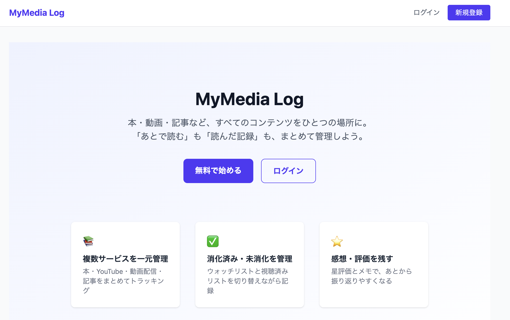
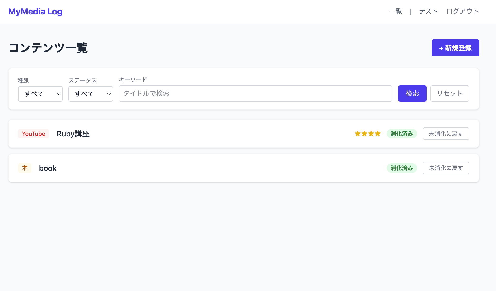
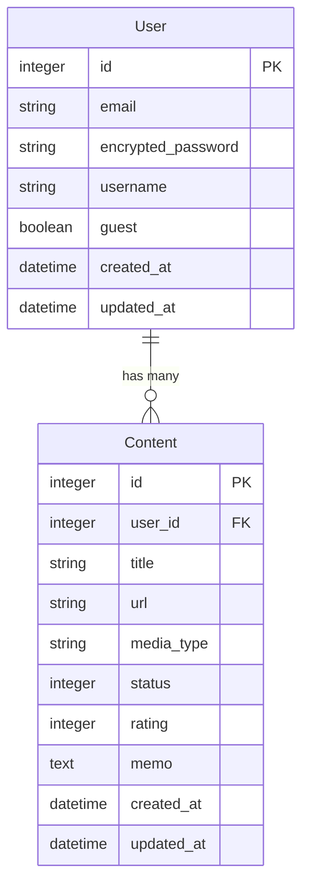

# MyMedia Log

本・動画・記事など、複数サービスにまたがるコンテンツを一元管理するパーソナルメディアトラッカーです。
「あとで観る/読む」リストと「観た/読んだ」記録をひとつの場所にまとめることで、サービスをまたいだウォッチリスト・読みたいリストの管理課題を解決します。

---

## スクリーンショット

### ランディングページ


### コンテンツ一覧


---

## 機能一覧

### 認証
- ユーザー登録・ログイン・ログアウト（Devise）
- ゲストログイン（登録なしでアプリを試せる）

### マイページ
- ユーザー名・メールアドレス・パスワードの編集
- 種別ごとのコンテンツ割合グラフ（chartkick + groupdate）
- ゲストユーザーはプロフィール編集不可

### コンテンツ管理（CRUD）
- タイトル・URL・種別・メモを登録
- 種別：本 / YouTube / 動画配信 / 記事 / その他
- 一覧表示・詳細表示・編集・削除
- ページネーション（kaminari、20件/ページ）

### ステータス管理
- 未消化 ↔ 消化済み の切り替え（Rails enum）
- 未消化に戻すと星評価が自動リセット

### 絞り込み・検索
- 種別でのフィルタリング
- ステータスでのフィルタリング
- タイトルのキーワード検索

### 記録
- 星評価（1〜5）※消化済み時のみ
- 一言メモ・感想

---

## 技術スタック

| カテゴリ | 技術 |
|---|---|
| 言語 | Ruby 3.3.10 |
| フレームワーク | Ruby on Rails 7.2.3 |
| フロントエンド | Tailwind CSS 4.x |
| データベース | PostgreSQL |
| 認証 | Devise |
| ページネーション | kaminari |
| グラフ表示 | chartkick + groupdate |
| テスト | RSpec（model / request / system spec） |
| デプロイ | Heroku |
| バージョン管理 | GitHub |

---

## ER図



---

## セットアップ

```bash
# リポジトリをクローン
git clone <repository_url>
cd mymedialog

# 依存関係インストール
bundle install

# データベース作成・マイグレーション
bin/rails db:create db:migrate

# 開発サーバー起動（Tailwind CSSウォッチャー含む）
bin/dev
```

## 今後の展望

現在のスコープ外として、以下の機能追加を検討しています。

- **ユーザー間共有・SNS機能** — コンテンツのおすすめや感想をフォロワーとシェア
- **外部API連携** — Google Books・YouTube Data API などからタイトル・サムネイルを自動取得
- **スマホアプリ** — iOS / Android ネイティブアプリ、またはPWA対応強化
- **アバター画像のアップロード** — プロフィール画像の設定（Active Storage）
